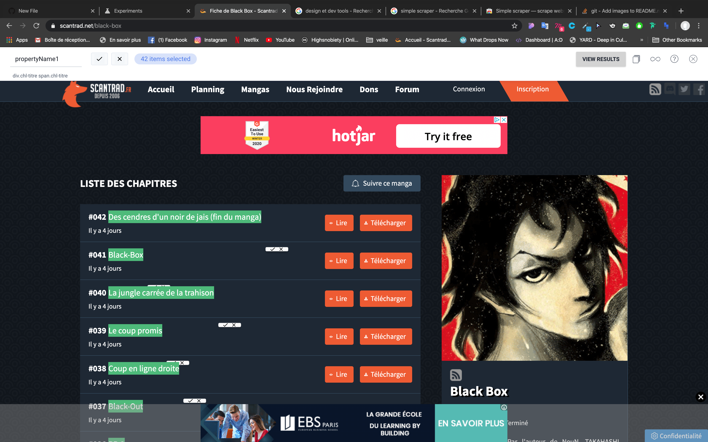
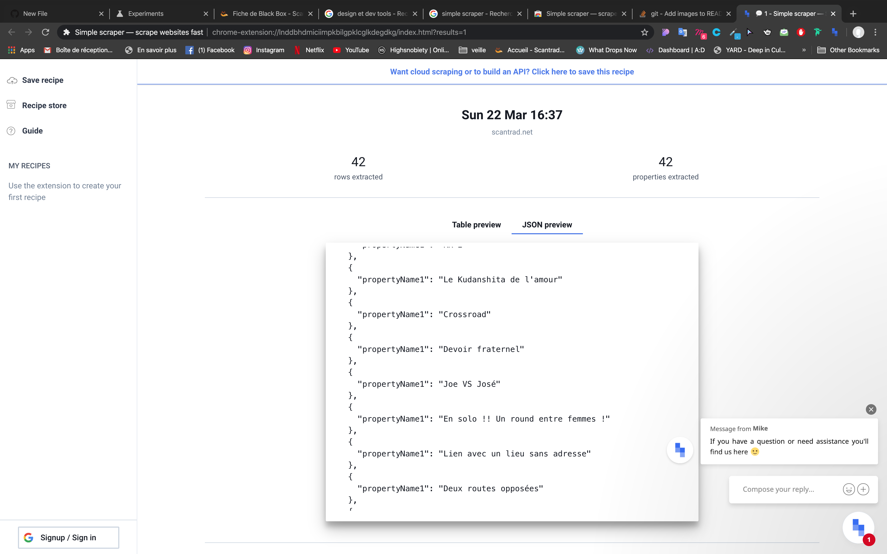

# Qui prend quoi

## Installation

_À modifier si votre travail le nécessite_

`npm install`

`npm run start`

## Améliorations apportées

_Pour chaque amélioration, un message type "message de commit" et si pertinent le nom des fichiers principalement concernés_

_Quelques exemples (voir le TP)_

- Affichage de la liste des items sur la page événément (`app.js`, `party.pug`)
- Possibilité de supprimer un item (`app.js`, `party.pug`)
- Rafraîchissement automatique des items avec _fetch_ (`party.js`)
- Utilisation du localStorage pour stocker le nom de l'utilisateur (`user.js`)
- Meilleure présentation visuelle des items (`party.scss`)

## Article personnel

Simple scraper est un outil permettant en quelques secondes de créer un API à partir d'un site internet.
Il permet de telecharger instantanement les données d'un site dont vous avez besoin au format JSON ou XLS.
Sous forme d'un plugin Chrome, il vous suffit de le lancer sur une page et de selectionner les éléments que vous voulez extraire.

Voici ici une video pour la transformation en API

https://res.cloudinary.com/simplescraper/video/upload/q_auto/v1576758706/simplescraper-api_yepjtj.mp4

Avec des plugins permettant de coupler figma à de la vrai data , cet outil est un réel plus pour faire des design réaliste.
Pour le dev il permet de rapidement mapper un site si il ne propose pas d'open data.