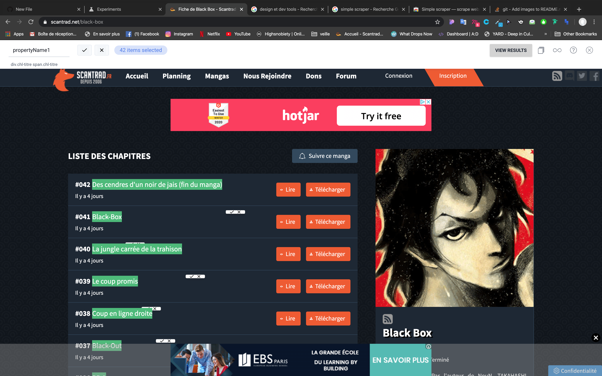

# Qui prend quoi

## Installation

_À modifier si votre travail le nécessite_

`npm install`

`npm run start`

## Améliorations apportées

_Pour chaque amélioration, un message type "message de commit" et si pertinent le nom des fichiers principalement concernés_

_Quelques exemples (voir le TP)_

- Affichage de la liste des items sur la page événément (`app.js`, `party.pug`)
- Possibilité de supprimer un item (`app.js`, `party.pug`)
- Rafraîchissement automatique des items avec _fetch_ (`party.js`)
- Utilisation du localStorage pour stocker le nom de l'utilisateur (`user.js`)
- Meilleure présentation visuelle des items (`party.scss`)

## Article personnel

Simple scraper est un outil permettant en quelques secondes de créer un API à partir d'un site internet.
Il permet de telecharger instantanement les données d'un site dont vous avez besoin au format JSON ou XLS.
Sous forme d'un plugin Chrome, il vous suffit de le lancer sur une page et de selectionner les éléments que vous voulez extraire.

 "Title")

Le sujet peut être :

- une web api explorée (même en partie)
- un outil ou technique lié à la performance, l'amélioration progressive, l'accessibilité
- une technique liée aux PWA ou aux service workers
- un outil de développement (package npm, devtool...)

Ce n'est pas une liste exhaustive, demandez en cas de doute.

Plan en cas de panne d'inspiration :

- Description du sujet choisi (sa définition, son but...)
- Exemple d'utitlisation ou d'implémentation (bout de code si pertinent, capture d'écran...)
- Conclusion : avantages, inconvénients et cas d'usage
